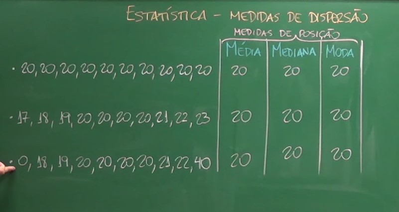

# ESTATÍSTICA

## SUMÁRIO

- [ESTATÍSTICA](#estatística)
  - [SUMÁRIO](#sumário)
  - [EXPLICAÇÃO DE TERMOS](#explicação-de-termos)
    - [MEDIANA (MEDIDA DE POSIÇÃO)](#mediana-medida-de-posição)
    - [AMPLITUDE (MEDIDA DE DISPERSÃO)](#amplitude-medida-de-dispersão)
    - [DISTANCIA INTERQUARTIL (MEDIDA DE DISPERSÃO)](#distancia-interquartil-medida-de-dispersão)
    - [VARIÂNCIA POPULACIONAL OU DESVIO QUADRÁTICO MÉDIO POPULACIONAL (MEDIDA DE DISPERSÃO)](#variância-populacional-ou-desvio-quadrático-médio-populacional-medida-de-dispersão)
    - [VARIÂNCIA AMOSTRAL OU DESVIO QUADRÁTICO MÉDIO AMOSTRAL (MEDIDA DE DISPERSÃO)](#variância-amostral-ou-desvio-quadrático-médio-amostral-medida-de-dispersão)
    - [COEFICIENTE DE CORRELAÇÃO DE PEARSON (R)](#coeficiente-de-correlação-de-pearson-r)
    - [COEFICIENTE DE CORRELAÇÃO DE SPEARMAN (Ρ OU RS)](#coeficiente-de-correlação-de-spearman-ρ-ou-rs)
    - [COEFICIENTE DE CORRELAÇÃO DE KENDALL (Τ OU TAU)](#coeficiente-de-correlação-de-kendall-τ-ou-tau)
    - [COEFICIENTE DE CORRELAÇÃO DE POINT-BISERIAL](#coeficiente-de-correlação-de-point-biserial)
    - [COEFICIENTE DE CORRELAÇÃO DE CRAMER'S V](#coeficiente-de-correlação-de-cramers-v)
    - [COEFICIENTE DE CORRELAÇÃO DE BISERIAL](#coeficiente-de-correlação-de-biserial)
    - [COEFICIENTE DE CORRELAÇÃO PARCIAL](#coeficiente-de-correlação-parcial)
    - [DISTRIBUIÇÃO NORMAL](#distribuição-normal)
    - [VARIÁVEIS QUANTITATIVAS](#variáveis-quantitativas)
      - [VARIÁVEIS CONTÍNUA](#variáveis-contínua)
      - [VARIÁVEIS DISCRETA](#variáveis-discreta)
    - [VARIÁVEIS QUALITATIVAS](#variáveis-qualitativas)
      - [VARIÁVEIS NOMINAIS](#variáveis-nominais)
      - [VARIÁVEIS ORDINAIS](#variáveis-ordinais)
    - [TESTE T](#teste-t)
    - [TESTE PARAMÉTRICO](#teste-paramétrico)
    - [TESTE NÃO PARAMÉTRICO](#teste-não-paramétrico)
    - [REGRESSÃO](#regressão)
    - [ANOVA](#anova)
    - [VARIÁVEL ALEATÓRIA](#variável-aleatória)
    - [COVARIÂNCIA AMOSTRAL](#covariância-amostral)
    - [COVARIÂNCIA POPULACIONAL](#covariância-populacional)
  - [OBSERVAÇÕES](#observações)
  - [ESTATÍSTICA DESCRITIVA](#estatística-descritiva)
  - [ESTATISTICA BAYESIANA](#estatistica-bayesiana)
    - [MEDIDAS DE POSIÇÃO (MÉDIA, MEDIANA, MODA) NÃO SÃO SUFICIENTES PARA A REALIZAÇÃO DE UMA ANÁLISE ESTATÍSTICA](#medidas-de-posição-média-mediana-moda-não-são-suficientes-para-a-realização-de-uma-análise-estatística)
    - [A AMPLITUDE NÃO É A MELHOR ESCOLHA PARA MEDIR A DISPERSÃO DE UMA AMOSTRA](#a-amplitude-não-é-a-melhor-escolha-para-medir-a-dispersão-de-uma-amostra)
    - [É IMPORTANTE TESTAR SE OS DADOS POSSUEM DISTRIBUIÇÃO NORMAL](#é-importante-testar-se-os-dados-possuem-distribuição-normal)

## EXPLICAÇÃO DE TERMOS

### MEDIANA (MEDIDA DE POSIÇÃO)

    Em estatística, a mediana é uma medida de tendência central que divide um conjunto de dados ordenados em duas partes iguais, com metade dos valores acima da mediana e metade abaixo.

    A mediana é calculada da seguinte forma:

    1) Ordene os dados em ordem crescente ou decrescente.
    2) Encontre o valor no meio da lista.
    3) Esse valor é a mediana.

    Por exemplo, se um conjunto de dados contém as seguintes notas: 7, 8, 9, 10, 11, a mediana é 9.

    A mediana é uma medida de tendência central robusta, o que significa que ela não é afetada por outliers, ou seja, por dados que estão muito distantes da maioria dos dados.

    A mediana é frequentemente usada em conjunto com outras medidas de tendência central, como a média e a moda, para obter uma visão mais completa da distribuição dos dados.

    Aqui estão alguns exemplos de como a mediana pode ser usada:

    1) Um professor pode usar a mediana das notas dos alunos para avaliar o desempenho da turma. Se a mediana for alta, significa que a maioria dos alunos está com notas boas.
    
    2) Uma empresa pode usar a mediana dos preços dos produtos para avaliar a competitividade do mercado. Se a mediana for alta, significa que a maioria dos produtos está com preços altos.
    
    3) Um governo pode usar a mediana da renda da população para avaliar a desigualdade social. Se a mediana for alta, significa que a maioria da população tem renda alta.

    A mediana é uma medida de tendência central versátil e fácil de interpretar, que pode ser usada em uma variedade de aplicações. 

### AMPLITUDE (MEDIDA DE DISPERSÃO)

    Em estatística, a amplitude é uma medida de dispersão que representa a distância entre o maior e o menor valor de um conjunto de dados. Ela é calculada da seguinte forma:

    Amplitude = maior valor - menor valor

    Por exemplo, se um conjunto de dados contém as seguintes notas: 7, 8, 9, 10, 11, a amplitude seria 4 (11 - 7).

    A amplitude é uma medida simples de dispersão, mas pode ser útil para obter uma ideia geral da variação dos dados. Em geral, quanto maior a amplitude, mais dispersos estão os dados. Por exemplo, no conjunto de dados acima, os dados estão mais dispersos do que se a amplitude fosse 1 (11 - 10).

    A amplitude pode ser usada em conjunto com outras medidas de dispersão, como a variância e o desvio padrão, para obter uma visão mais completa da distribuição dos dados.

    Aqui estão alguns exemplos de como a amplitude pode ser usada:

    1) Um professor pode usar a amplitude das notas dos alunos para avaliar o desempenho da turma. Se a amplitude for alta, significa que os alunos estão com notas muito diferentes.
   
    2) Uma empresa pode usar a amplitude dos preços dos produtos para avaliar a competitividade do mercado. Se a amplitude for alta, significa que os preços dos produtos são muito diferentes.

    3) Um governo pode usar a amplitude da renda da população para avaliar a desigualdade social. Se a amplitude for alta, significa que a renda da população está muito concentrada.

    A amplitude é uma medida de dispersão simples e útil que pode ser usada em uma variedade de aplicações.

### DISTANCIA INTERQUARTIL (MEDIDA DE DISPERSÃO)

    Em estatística, a distância interquartil (IQR), também conhecida como intervalo interquartil ou amplitude interquartílica, é uma medida de dispersão que representa a distância entre o terceiro quartil (Q3) e o primeiro quartil (Q1) de um conjunto de dados ordenados. Ela é calculada da seguinte forma:

    IQR = Q3 - Q1

    Por exemplo, se um conjunto de dados contém as seguintes notas: 7, 8, 9, 10, 11, o IQR seria 2 (11 - 9).

    A distância interquartil é uma medida de dispersão robusta, o que significa que ela não é afetada por outliers, ou seja, por dados que estão muito distantes da maioria dos dados. Em geral, quanto maior a distância interquartil, mais dispersos estão os dados. Por exemplo, no conjunto de dados acima, os dados estão mais dispersos do que se o IQR fosse 1 (11 - 10).

    A distância interquartil pode ser usada em conjunto com outras medidas de dispersão, como a variância e o desvio padrão, para obter uma visão mais completa da distribuição dos dados.

    Aqui estão alguns exemplos de como a distância interquartil pode ser usada:

    1) Um professor pode usar a distância interquartil das notas dos alunos para avaliar o desempenho da turma. Se a distância interquartil for alta, significa que os alunos estão com notas muito diferentes.
    
    2) Uma empresa pode usar a distância interquartil dos preços dos produtos para avaliar a competitividade do mercado. Se a distância interquartil for alta, significa que os preços dos produtos são muito diferentes.
    
    3) Um governo pode usar a distância interquartil da renda da população para avaliar a desigualdade social. Se a distância interquartil for alta, significa que a renda da população está muito concentrada.

    A distância interquartil é uma medida de dispersão robusta e fácil de interpretar, que pode ser usada em uma variedade de aplicações.

### VARIÂNCIA POPULACIONAL OU DESVIO QUADRÁTICO MÉDIO POPULACIONAL (MEDIDA DE DISPERSÃO)

    Em estatística, a variância populacional é uma medida de dispersão que mede a variação dos valores de uma população em torno da média populacional. Ela é calculada da seguinte forma:

    Variância populacional = (∑(x - μ)^2) / N

    onde:

    1) x é um valor da população
    2) μ é a média populacional
    3) N é o tamanho da população

    A variância populacional é uma medida não negativa, e quanto maior a variância, mais dispersos estão os valores da população. Por exemplo, se a variância populacional for alta, significa que os valores da população estão muito espalhados em torno da média.

    A variância populacional pode ser usada em conjunto com outras medidas de dispersão, como o desvio padrão populacional, para obter uma visão mais completa da distribuição dos dados.

    Aqui estão alguns exemplos de como a variância populacional pode ser usada:

    1) Um fabricante de carros pode usar a variância populacional do peso dos carros para avaliar a qualidade dos carros. Se a variância populacional for alta, significa que os carros estão com pesos muito diferentes.
    
    2) Um hospital pode usar a variância populacional da idade dos pacientes para avaliar a saúde da população. Se a variância populacional for alta, significa que a população está com idades muito diferentes.

    3) Um governo pode usar a variância populacional da renda da população para avaliar a desigualdade social. Se a variância populacional for alta, significa que a renda da população está muito concentrada.

    A variância populacional é uma medida de dispersão importante que pode ser usada em uma variedade de aplicações.

### VARIÂNCIA AMOSTRAL OU DESVIO QUADRÁTICO MÉDIO AMOSTRAL (MEDIDA DE DISPERSÃO)

    Em estatística, a variância amostral é uma medida de dispersão que mede a variação dos valores de uma amostra em torno da média amostral. Ela é calculada da seguinte forma:

    Variância amostral = (∑(x - x̄)^2) / (n - 1)

    onde:

    1) x é um valor da amostra
    2) x̄ é a média amostral
    3) n é o tamanho da amostra

    A variância amostral é uma medida não negativa, e quanto maior a variância, mais dispersos estão os valores da amostra. Por exemplo, se a variância amostral for alta, significa que os valores da amostra estão muito espalhados em torno da média.

    A variância amostral é uma estimativa da variância populacional. Isso significa que, se a variância amostral for alta, é provável que a variância populacional também seja alta.

    A variância amostral pode ser usada em conjunto com outras medidas de dispersão, como o desvio padrão amostral, para obter uma visão mais completa da distribuição dos dados.

    Aqui estão alguns exemplos de como a variância amostral pode ser usada:

    1) Um pesquisador pode usar a variância amostral das notas dos alunos para avaliar o desempenho da turma. Se a variância amostral for alta, significa que os alunos estão com notas muito diferentes.

    2) Uma empresa pode usar a variância amostral dos preços dos produtos para avaliar a competitividade do mercado. Se a variância amostral for alta, significa que os preços dos produtos são muito diferentes.

    3) Um governo pode usar a variância amostral da renda da população para avaliar a desigualdade social. Se a variância amostral for alta, significa que a renda da população está muito concentrada.

    A variância amostral é uma medida de dispersão importante que pode ser usada em uma variedade de aplicações.

    A diferença entre a variância populacional e a variância amostral é que a variância populacional é calculada usando todos os valores da população, enquanto a variância amostral é calculada usando apenas uma amostra da população. Isso significa que a variância amostral é uma estimativa da variância populacional.

    A variância amostral é uma estimativa não tendenciosa da variância populacional, o que significa que, em média, a variância amostral é igual à variância populacional. No entanto, a variância amostral é menos precisa do que a variância populacional, pois é baseada em apenas uma amostra da população.

    O tamanho da amostra afeta a precisão da variância amostral. Quanto maior a amostra, mais precisa será a variância amostral.

### COEFICIENTE DE CORRELAÇÃO DE PEARSON (R)

### COEFICIENTE DE CORRELAÇÃO DE SPEARMAN (Ρ OU RS)

### COEFICIENTE DE CORRELAÇÃO DE KENDALL (Τ OU TAU)

### COEFICIENTE DE CORRELAÇÃO DE POINT-BISERIAL

### COEFICIENTE DE CORRELAÇÃO DE CRAMER'S V

### COEFICIENTE DE CORRELAÇÃO DE BISERIAL

### COEFICIENTE DE CORRELAÇÃO PARCIAL

### DISTRIBUIÇÃO NORMAL

### VARIÁVEIS QUANTITATIVAS

#### VARIÁVEIS CONTÍNUA

#### VARIÁVEIS DISCRETA

### VARIÁVEIS QUALITATIVAS

#### VARIÁVEIS NOMINAIS

#### VARIÁVEIS ORDINAIS

### TESTE T

### TESTE PARAMÉTRICO

### TESTE NÃO PARAMÉTRICO

### REGRESSÃO

### ANOVA

### VARIÁVEL ALEATÓRIA

### COVARIÂNCIA AMOSTRAL

### COVARIÂNCIA POPULACIONAL

## OBSERVAÇÕES

## ESTATÍSTICA DESCRITIVA

## ESTATISTICA BAYESIANA

### MEDIDAS DE POSIÇÃO (MÉDIA, MEDIANA, MODA) NÃO SÃO SUFICIENTES PARA A REALIZAÇÃO DE UMA ANÁLISE ESTATÍSTICA  

    Mediadas de posição (Média, Mediana, Moda) não são suficientes para a realização de uma análise estatística, pois essas medidas não analisam a distribuição dos dados, ou seja, conjuntos de dados com diferentes distribuições podem apresentar a mesma média, mediana e moda. 

    Ex:

### A AMPLITUDE NÃO É A MELHOR ESCOLHA PARA MEDIR A DISPERSÃO DE UMA AMOSTRA

### É IMPORTANTE TESTAR SE OS DADOS POSSUEM DISTRIBUIÇÃO NORMAL